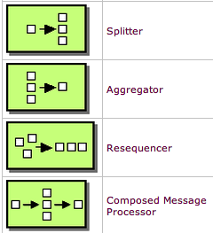
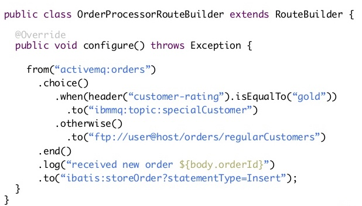
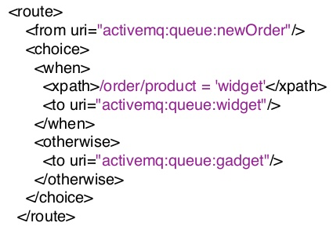
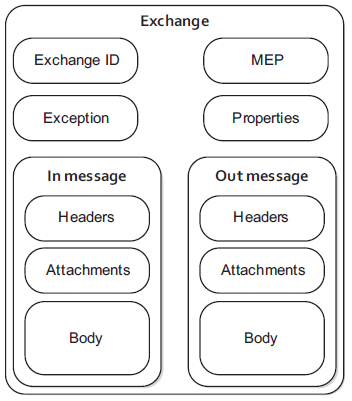
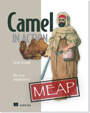

<!-- .element class="center" -->
# 
Apache Camel Workshop

---
## Agenda
- Introductie
- Wat gaan we vandaag doen?
- Enterprise Integration Patterns (EIP)
- Apache Camel
- Workshop
---
## Introductie
**Ivo Woltring**  

Software Architect and CodeSmith @ Ordina

**Edwin Derks**  

Software and Solutions Architect @ Ordina

---
## Wat gaan we vandaag doen?
- Theorie
- Hands-on bouwen van Camel integratie module

---

---
## Enterprise Integration Patterns (EIP)
- Wat zijn dit en doen ze?

---
## Apache Camel
- Geschiedenis
- Wat is het en wat doet het?
- Community
- Literatuur

---
## Apache Camel Geschiedenis

---
## Apache Camel
- Software integratie framework
- Talloze componenten
- Geprogrammeerd in Java!
- Verschillende DSL's, waaronder XML en Java
- Beschikbaar als Maven artifacts
- Standalone of integreren met Spring

---
## Apache Camel Componenten

https://mvnrepository.com/artifact/org.apache.camel/camel-core

    <dependency>
        <groupId>org.apache.camel</groupId>
        <artifactId>camel-core</artifactId>
        <version>2.19.3</version>
    </dependency>

https://mvnrepository.com/artifact/org.apache.camel/camel-amqp

    <dependency>
        <groupId>org.apache.camel</groupId>
        <artifactId>camel-amqp</artifactId>
        <version>2.19.3</version>
    </dependency>
    
---
## Apache Camel Java DSL

---
## Apache Camel XML DSL

---
## Apache Camel: De basis
- Camel componenten
- Definieer routes
- Data wordt verscheept door route, verpakt in een Exchange

---
## Apache Camel Community
Community  

    http://camel.apache.org/

- Onbekend maar niet onbemind
- Onzichtbaar
- Cloud

---
## Apache Camel Literatuur
- Camel in Action (2nd Edition)

    https://www.manning.com/books/camel-in-action-second-edition

---
## Workshop
Github repo:  
**https://github.com/Ordina-JTech/camel-workshop**

